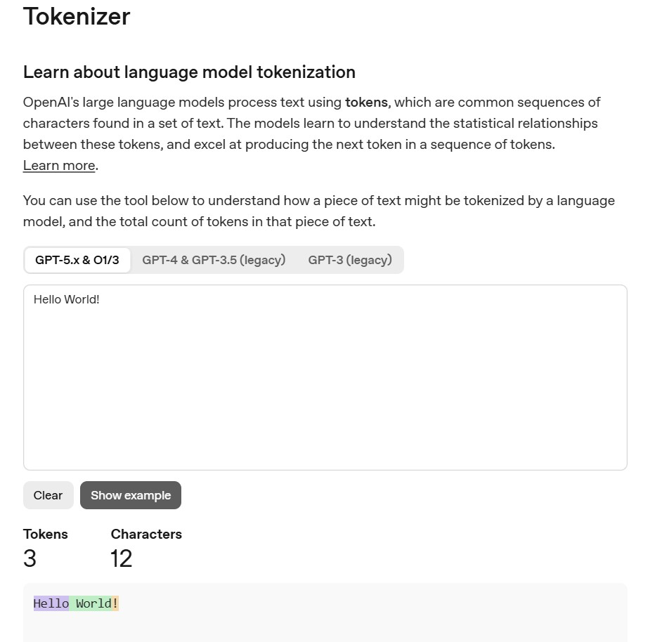

# AI 核心概念
[EN](./README.md) | [中文](./AI_Concepts_zh.md)

## 基础理论

### 1. AI（人工智能）

AI（人工智能）是一个科学与技术领域，专注于让机器模拟人类智能。  
它的目标是构建能够执行通常需要人类智能才能完成任务的系统，例如：

- 理解和生成语言
- 识别图像和语音
- 做出判断与决策
- 从数据中学习并持续优化表现

按能力范围划分，AI 通常分为两个核心概念：

#### 1.1. ANI（狭义人工智能）

ANI 是**狭义人工智能**，也称“弱 AI”。  
它在特定任务上表现优秀，但无法跨不同领域进行泛化。

常见例子：

- 推荐系统（例如短视频推荐）
- 单一用途的语音助手功能
- 人脸识别
- 棋盘类游戏程序

#### 1.2. AGI（通用人工智能）

AGI 是**通用人工智能**，也称“强 AI”。  
它指的是类人通用认知能力：能够在不同任务和环境中进行理解、学习、推理与知识迁移。

AGI 目前仍是研究目标，尚未被完全实现。

### 2. ML（机器学习）

机器学习是人工智能的一个**子集**，核心是让系统从数据中学习。  
与使用固定规则显式编程不同，机器学习算法通过统计模型从大规模数据中识别模式，从而自动提升性能并进行预测。

AI 与 ML 的关系：AI 是**目标**，ML 是**方法**。

#### 2.1. 监督学习（Supervised Learning）
- 输入（A） -> 输出（B）（从输入到输出的映射）
- 高度依赖**标注数据的质量与数量**以及**模型容量**。

#### 2.2. 无监督学习（Unsupervised Learning）
- 从无标签数据中学习数据结构。
- 常见任务包括聚类、降维与异常检测。

#### 2.3. 强化学习（Reinforcement Learning）
- 智能体与环境交互，并通过奖励与惩罚进行学习。
- 常见于游戏对弈、机器人控制与序列决策问题。

### 3. DL（深度学习）

深度学习是机器学习的一个**子集**，核心基础是多层神经网络。

#### 3.1. 为什么深度学习重要
- 它能够从原始数据中自动学习高层特征表示。
- 它推动了计算机视觉、语音识别与自然语言处理等领域的显著进展。

#### 3.2. 与现代 AI 的关系
- 现代大多数大语言模型（LLM）都建立在深度学习架构之上（例如 Transformer）。
- 在实践中：AI 是大范畴，ML 是核心方法，而 DL 支撑了大量当前最先进的 AI 系统。

## The GenAI Era（生成式 AI 与 LLM）

### 4. 生成式 AI 与 LLM（Generative AI & Large Language Models）

深度学习是基础，而生成式 AI 的突破让 AI 真正进入了日常场景。

#### 4.1. 生成式 AI（GenAI）
与传统机器学习主要做分类或预测（例如“这是不是一只猫？”）不同，GenAI 可以基于训练数据中学到的模式，生成**全新内容**，包括文本、图像、音频或视频。

#### 4.2. LLM（大语言模型）
LLM 是一种专注于文本的生成式 AI。  
- **核心机制：** 在底层，LLM 本质上是根据上下文预测下一个最可能出现的 token（词/字符）。  
- **架构：** 现代大多数 LLM 基于 **Transformer** 架构（深度学习模型的一种）。  
- **示例：** GPT-4、Claude 3、Gemini。

##### 4.2.1 Tokens（token 与分词理解）
LLM 并不真正“逐字读取文本”。它处理的是 **token**，也就是由分词（tokenization）产生的小文本单元。  
一个 token 可能是一个完整的词、词的一部分，甚至是标点符号。

分词会把你的输入转换成 token 序列（token IDs）。随后模型会一步步处理这些 token，并生成下一个 token。

两个现实影响：
- **上下文窗口**通常按 token 计数，所以过长的提示可能会被截断。
- 不同模型使用的分词器对 token 的划分方式不同，因此 token 限制与成本会因模型而异。

可参考分词工具：[OpenAI Tokenizer](https://platform.openai.com/tokenizer)  

#### 4.3. 实际限制
- LLM 可能在“听起来很自信”的同时给出错误内容（即“幻觉”），因此在关键任务中仍需要人工或系统化校验。

## Agents & Engineering（智能体与工程实践）

### 5. AI Agent 与 Skills

如果说 LLM 是一个“只能说话的大脑”，那么 AI Agent 就是在同一个大脑基础上，增加了“手、眼睛和记忆”。

#### 5.1. AI Agent
AI Agent 是由 LLM 驱动的自治系统，能够感知环境、做出决策，并执行动作以实现特定目标。  
一个常见公式是：**Agent = LLM + Memory + Planning + Tools**。

#### 5.2. Skills / Tools
Skills（或 Tools）是 Agent 的“手”。因为单独的 LLM 往往不擅长精确计算，也无法直接访问实时信息，因此我们给它可调用的 API 接口。  
参考科普视频：[《【闪客】一口气拆穿Skill/MCP/RAG/Agent/OpenClaw底层逻辑》](https://www.bilibili.com/video/BV1ojfDBSEPv?vd_source=7ec1163e22daf4515c09a5b6d9b99bae)  

##### 5.2.1 Context Prompt（上下文提示词/上下文）
LLM 不只是“从模型参数里回答”，它依赖你提供的上下文。  
Context Prompt 指的是：由消息内容 +（可能通过检索得到的）相关信息共同组成，让模型知道该基于什么背景来生成答案的输入部分。

常见上下文来源包括：
- 系统指令（约束助手行为与规则）
- 用户请求（具体目标）
- 检索到的内容（例如 RAG 结果）、日志、数据库片段、或工具返回的结果

由于上下文窗口是有限的，好的提示往往不是把所有信息都塞进去，而是选择最相关、最有用的部分。

##### 5.2.2 MCP（Model Context Protocol，模型上下文协议）
MCP（Model Context Protocol）是一种协议，帮助模型和智能体以更标准的方式连接外部工具、资源和数据。

在实践中，MCP 通过减少“各自为政的一次性集成”，让上下文获取与工具接入更一致：
- 智能体可以发现可用的资源与可执行动作
- 工具调用可以遵循统一的接口形式
- 应用可以更安全地只暴露必要且允许的能力

在 Agent 工作流里，MCP 可以理解为连接 LLM 与外部世界的一座更可靠的桥梁。

- **示例：** Web Search Skill、Python Execution Skill、Database Query Skill。  
- **工作流：** 你问今天的天气 -> Agent 规划步骤 -> 调用 Web Search Skill -> 将结果返回给 LLM -> LLM 组织成人类可读回答。

### 6. AI 驱动开发（“Vibe Coding” 时代）

将 LLM 和 Agent 应用于软件工程，正在形成一种新的开发范式，通常被称为 **“Vibe Coding”**：开发者通过自然语言来引导架构与意图，AI 编码 Agent 负责大量语法与实现细节。

#### 6.1. Cursor
- **它是什么：** 以 AI 为核心的代码编辑器（基于 VS Code 的分支版本）。  
- **适用场景：** 人机协作式编程。它具备较强的代码库上下文理解能力和实时 diff 预览能力。

#### 6.2. Claude Code
- **它是什么：** Anthropic 提供的 CLI（命令行）Agent。  
- **适用场景：** 终端原生工作流。它可以在无图形界面的情况下自主浏览目录、运行测试并重构代码。

#### 6.3. OpenAI Codex
- **它是什么：** OpenAI 的 Agentic Coding 平台。  
- **适用场景：** 委派复杂、可并行的开发任务。它可管理独立 Git worktree，运行并行开发线程，更像虚拟开发团队而不只是自动补全工具。
